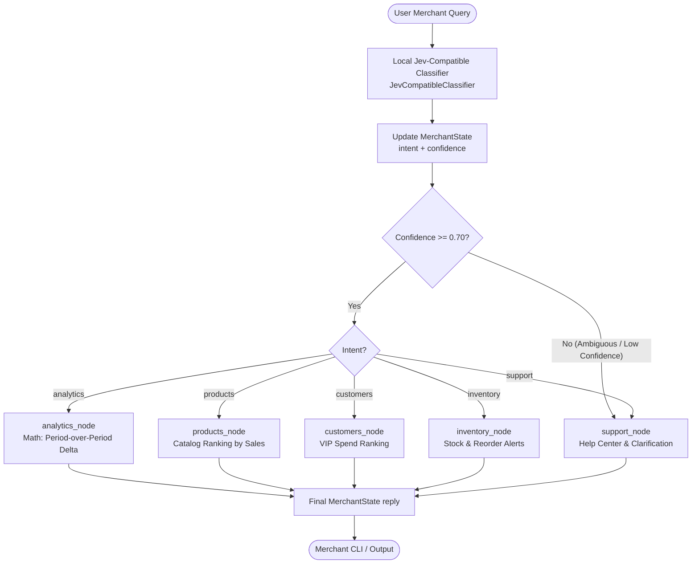

# 🛍️ Merchant Intelligence Router (VyaparMitra)
### *A Zero-Cost Local Jev-Compatible Architecture with LangGraph*

> ⚠️ **IMPORTANT CLARIFICATION**:  
> **This project reproduces the architectural pattern of a Jev classifier locally for learning and zero-cost development. It is not the official TypeSafe AI Jev service and does not use the TypeSafe AI Jev API.**  
> It is an educational and modular compatibility layer (`JevCompatibleClassifier`) designed to run 100% locally at ₹0 cost without external API keys, while remaining architecturally identical to the Jev + LangGraph design pattern.

---

## 📑 Table of Contents
1. [What is this Project?](#1-what-is-this-project)
2. [Architecture Overview](#2-architecture-overview)
3. [Mermaid Architecture Flowchart](#3-mermaid-architecture-flowchart)
4. [The Jev-Compatible Local Classifier](#4-the-jev-compatible-local-classifier)
5. [Choice & Intent Abstractions](#5-choice--intent-abstractions)
6. [TF-IDF & Cosine Similarity Explanation](#6-tf-idf--cosine-similarity-explanation)
7. [Confidence Calculation & Ambiguity Detection](#7-confidence-calculation--ambiguity-detection)
8. [Confidence Routing Guardrail](#8-confidence-routing-guardrail)
9. [LangGraph StateGraph Integration](#9-langgraph-stategraph-integration)
10. [Specialized Business Nodes & Deterministic Logic](#10-specialized-business-nodes--deterministic-logic)
11. [Why Not Simply Use an LLM?](#11-why-not-simply-use-an-llm)
12. [How to Replace with Real Jev Later](#12-how-to-replace-with-real-jev-later)
13. [Limitations of TF-IDF Classification](#13-limitations-of-tf-idf-classification)
14. [Installation & Requirements](#14-installation--requirements)
15. [How to Run (Interactive CLI & Explain Mode)](#15-how-to-run-interactive-cli--explain-mode)
16. [How to Run Automated Tests](#16-how-to-run-automated-tests)
17. [Project File Tree](#17-project-file-tree)

---

## 1. What is this Project?
**Merchant Intelligence Router (VyaparMitra)** is an AI agent architecture for merchants. It receives natural language questions across five business domains:
* 📊 **`analytics`**: *"How much did I sell today?"*, *"Why were my sales low yesterday?"*
* 📦 **`products`**: *"Show me my top 5 products"*, *"What is my best selling product?"*
* 👥 **`customers`**: *"Who are my repeat customers?"*, *"Which customers bought from me most?"*
* 📋 **`inventory`**: *"Which products are low in stock?"*, *"What should I reorder?"*
* ❓ **`support`**: *"Help me"*, *"How does this work?"*, *"How do I use this dashboard?"*

The system classifies user intent in sub-milliseconds, checks classifier certainty via a confidence threshold, routes execution using a LangGraph state machine, calculates factual business metrics deterministically, and formats a clear response.

---

## 2. Architecture Overview

```text
USER MESSAGE
      ↓
LOCAL JEV-COMPATIBLE CLASSIFIER (TF-IDF + Cosine Similarity)
      ↓
INTENT + CONFIDENCE
      ↓
CONFIDENCE ROUTER (Threshold: 0.70)
      ↓
LANGGRAPH (StateGraph)
      ↓
SPECIALIZED NODE (Analytics / Products / Customers / Inventory / Support)
      ↓
DETERMINISTIC BUSINESS LOGIC (Pure Python Math & DB Queries)
      ↓
OPTIONAL LLM EXPLANATION (Downstream executive synthesis)
      ↓
RESPONSE
```

---

## 3. Mermaid Architecture Flowchart



---

## 4. The Jev-Compatible Local Classifier
Instead of paying for API tokens or introducing network latency for routine routing, the project provides [`JevCompatibleClassifier`](file:///C:/Users/atuls/.gemini/antigravity/scratch/merchant-agent/app/classifier.py#L90-L200) which implements the [`BaseIntentClassifier`](file:///C:/Users/atuls/.gemini/antigravity/scratch/merchant-agent/app/classifier.py#L74-L88) interface:

```python
class BaseIntentClassifier(ABC):
    @abstractmethod
    def classify(self, message: str) -> ClassificationResult:
        pass

    @abstractmethod
    def explain(self, message: str) -> Dict[str, Any]:
        pass
```

This guarantees clean architectural decoupling: the LangGraph engine and business nodes only interact with `BaseIntentClassifier`.

---

## 5. Choice & Intent Abstractions
Inspired by Jev's typed categorical structure, we define discrete choices with descriptions and example phrases:

```python
class Choice(BaseModel):
    name: str
    description: str
    examples: list[str]

class Intent(str, Enum):
    ANALYTICS = "analytics"
    PRODUCTS = "products"
    CUSTOMERS = "customers"
    INVENTORY = "inventory"
    SUPPORT = "support"
```

---

## 6. TF-IDF & Cosine Similarity Explanation
1. **Corpus Construction**: Every example phrase and semantic description in `MERCHANT_CHOICES` is normalized and indexed.
2. **TF-IDF Vectorization**: Term Frequency-Inverse Document Frequency transforms raw queries and corpus phrases into spatial vectors with unigrams and bigrams (`ngram_range=(1, 2)`).
3. **Cosine Similarity**:
   $$\text{similarity}(\mathbf{q}, \mathbf{d}) = \frac{\mathbf{q} \cdot \mathbf{d}}{\|\mathbf{q}\| \|\mathbf{d}\|}$$
4. **Aggregation**: The classifier aggregates similarity scores across each discrete intent choice.

---

## 7. Confidence Calculation & Ambiguity Detection
Confidence is not hardcoded to `1.0`. It is dynamically computed using:
* **Top Similarity Magnitude**: How close the query is to the domain corpus.
* **Margin of Victory ($\Delta$)**: The difference between the highest score and second-highest score ($\text{margin} = \text{score}_1 - \text{score}_2$).
* **Ambiguity Handling**: Vague queries (e.g. *"show me something useful"*, *"tell me about my business"*) yield low margins and low similarity, giving confidence scores $< 0.70$.

---

## 8. Confidence Routing Guardrail
The function [`router_node(state)`](file:///C:/Users/atuls/.gemini/antigravity/scratch/merchant-agent/app/router.py#L32-L47) inspects `state.confidence`:

```python
if state.confidence < CONFIDENCE_THRESHOLD:  # Default: 0.70
    return "support"
return state.intent.value
```

If the merchant's query is ambiguous or out-of-domain, it never triggers high-stakes actions; it safely diverts to `support_node`.

---

## 9. LangGraph StateGraph Integration
LangGraph orchestrates the lifecycle using [`MerchantState`](file:///C:/Users/atuls/.gemini/antigravity/scratch/merchant-agent/app/state.py#L35-L48):
1. `START` $\rightarrow$ `jev_router`
2. `jev_router` $\rightarrow$ Conditional edge via `router_node`
3. Node execution $\rightarrow$ `analytics`, `products`, `customers`, `inventory`, or `support`
4. Node $\rightarrow$ `END`

---

## 10. Specialized Business Nodes & Deterministic Logic
All financial, inventory, and ranking metrics are calculated in Python using deterministic data in [`app/data/mock_data.py`](file:///C:/Users/atuls/.gemini/antigravity/scratch/merchant-agent/app/data/mock_data.py). The LLM is **never** permitted to hallucinate numbers.

---

## 11. Why Not Simply Use an LLM?
Relying solely on an LLM for all tasks introduces significant flaws:
* **Hallucination Risk**: LLMs cannot be trusted for arithmetic or financial totals.
* **High Latency & Cost**: Sending every classification step to an LLM adds hundreds of milliseconds and token fees.
* **Lack of Deterministic Control**: System 1 local classification + LangGraph guarantees deterministic state transitions and testability.

---

## 12. How to Replace with Real Jev Later
Because the system targets `BaseIntentClassifier`, you can swap the local classifier for official TypeSafe AI Jev with one new class:

```python
class RealJevClassifier(BaseIntentClassifier):
    def __init__(self, api_key: str):
        from langchain_typesafe import TypeSafeClassifier, Choice
        self.client = TypeSafeClassifier(api_key=api_key)

    def classify(self, message: str) -> ClassificationResult:
        res = self.client.invoke({"state": message, ...})
        return ClassificationResult(intent=Intent(res.choice), confidence=res.confidence)
```
Then update `app/classifier.py`: `default_classifier = RealJevClassifier(api_key=...)`. Zero changes required in LangGraph, routers, or domain nodes!

---

## 13. Limitations of TF-IDF Classification
* **Vocabulary Dependency**: Relies on vocabulary overlap and ngram matching.
* **Complex Multi-Step Logic**: Cannot perform deep relational multi-turn reasoning without downstream agents.
* **Subtle Semantic Nuance**: For highly complex linguistic ambiguity, fine-tuned embedding models or cloud classification models (like real Jev) offer broader contextual sensitivity.

---

## 14. Installation & Requirements

```bash
# Clone the repository
git clone https://github.com/atleekumaar/merchant-intelligence-router.git
cd merchant-intelligence-router

# Create virtual environment
python -m venv .venv
# On Windows:
.venv\Scripts\activate
# On Linux/macOS:
source .venv/bin/activate

# Install lightweight dependencies
pip install -r requirements.txt
```

---

## 15. How to Run the Interactive Web Platform & CLI

### Option A: Launch Interactive Web Architecture Platform (Recommended)
```bash
python server.py
```
Open **[http://localhost:8000](http://localhost:8000)** in your browser to experience the full interactive platform, including:
* **Simple View vs. Technical View** toggle
* **Interactive End-to-End Execution Simulator**
* **Live Step-by-Step Node Highlighter**
* **Deterministic Business Brains Data Inspector**

### Option B: Interactive Terminal CLI
```bash
python main.py
```

### Interactive Usage:
```text
You: how much did I sell today?

Intent: analytics
Confidence: 0.94

Assistant:
📊 Sales Analytics Summary:
• Yesterday (2026-10-01), your revenue was ₹31,200 across 41 orders.
• Compared to the previous day (2026-09-30 at ₹56,400), revenue saw a drop of 44.7%.
• Order volume also saw a drop of 47.4% (Avg order value: ₹760.98).
```

### Explain / Debug Mode:
```text
You: explain how much did I sell today?

🔍 [EXPLAIN MODE for 'how much did I sell today?']
Intent Similarity Scores:
  analytics    : 0.7412  ██████████████
  products     : 0.1205  ██
  customers    : 0.0811  █
  inventory    : 0.0412  
  support      : 0.0100  
Selected Intent   : analytics
Confidence        : 0.94
Passes Threshold  : True (Threshold: 0.70)
```

---

## 16. How to Run Automated Tests

```bash
python -m pytest -v
```

```text
============================= 54 passed in 4.00s ==============================
```

---

## 17. Project File Tree
```text
merchant-agent/
│
├── app/
│   ├── __init__.py
│   ├── state.py            # Pydantic MerchantState, Intent Enum, ClassificationResult
│   ├── choices.py          # Local Choice abstraction & MERCHANT_CHOICES dataset
│   ├── classifier.py       # BaseIntentClassifier & JevCompatibleClassifier (TF-IDF)
│   ├── router.py           # Confidence gate router
│   ├── graph.py            # LangGraph StateGraph workflow topology
│   ├── llm.py              # Downstream structured extraction & LLM synthesis
│   │
│   ├── nodes/
│   │   ├── __init__.py
│   │   ├── analytics.py    # Deterministic sales calculations & period deltas
│   │   ├── products.py     # Product ranking by volume
│   │   ├── customers.py    # VIP customer segmentation
│   │   ├── inventory.py    # Stock health & reorder alerts
│   │   └── support.py      # Help & low-confidence fallback
│   │
│   └── data/
│       ├── __init__.py
│       └── mock_data.py    # Deterministic mock merchant database
│
├── tests/
│   ├── __init__.py
│   ├── test_state.py       # Pydantic schema validation tests
│   ├── test_classifier.py  # Local classifier & explain mode tests
│   ├── test_router.py      # Confidence threshold routing tests
│   ├── test_nodes.py       # Specialized node execution tests
│   └── test_graph.py       # End-to-end LangGraph state machine tests
│
├── .env.example
├── .gitignore
├── requirements.txt
├── README.md
└── main.py                 # Interactive terminal CLI with Explain mode
```
