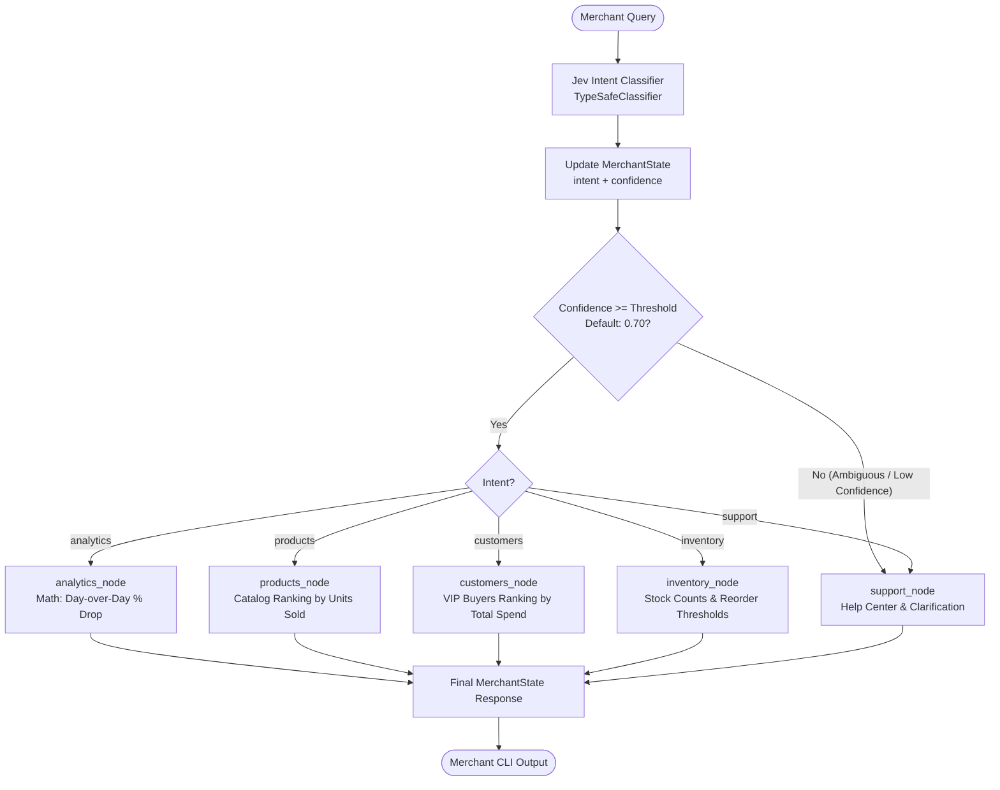

# 🛍️ VyaparMitra: Merchant Intelligence Router

A production-grade AI agent prototype demonstrating **Fast Intent Classification (Jev / TypeSafe)**, **Confidence-Based Guardrails**, **LangGraph StateGraph Routing**, and **Strict Deterministic Data Separation**.

Inspired by System 1 / System 2 cognitive architectures, this project processes natural language merchant inquiries (sales analytics, inventory stock, top-selling products, VIP customers, and dashboard help) with high speed, predictable cost, and zero numerical hallucinations.

---

## 📑 Table of Contents
1. [What the Project Does](#1-what-the-project-does)
2. [Architecture](#2-architecture)
3. [Mermaid Architecture Diagram](#3-mermaid-architecture-diagram)
4. [Why Jev is Used (System 1 vs. System 2)](#4-why-jev-is-used-system-1-vs-system-2)
5. [What TypeSafeClassifier Does](#5-what-typesafeclassifier-does)
6. [What Choice Does](#6-what-choice-does)
7. [What Confidence Means](#7-what-confidence-means)
8. [Why Confidence Routing Exists](#8-why-confidence-routing-exists)
9. [What LangGraph Does](#9-what-langgraph-does)
10. [What StateGraph Does](#10-what-stategraph-does)
11. [What Nodes Are](#11-what-nodes-are)
12. [What Edges Are](#12-what-edges-are)
13. [What Conditional Edges Are](#13-what-conditional-edges-are)
14. [Where the LLM is Used](#14-where-the-llm-is-used)
15. [Why Deterministic Business Logic is Separated from the LLM](#15-why-deterministic-business-logic-is-separated-from-the-llm)
16. [Installation](#16-installation)
17. [Environment Variables Configuration](#17-environment-variables-configuration)
18. [How to Run (Interactive CLI)](#18-how-to-run-interactive-cli)
19. [How to Run Tests](#19-how-to-run-tests)
20. [Example Conversations](#20-example-conversations)

---

## 1. What the Project Does
Merchant Intelligence Router acts as an intelligent assistant for merchants. It receives natural language questions from business owners—such as:
* *"Why were my sales low yesterday?"*
* *"Show me my top 5 products."*
* *"Which customers bought from me most?"*
* *"How much inventory do I have?"*
* *"I need help using the dashboard."*

The system classifies user intent, measures confidence, routes the query through a LangGraph state machine, queries deterministic business records, and outputs an accurate executive summary.

---

## 2. Architecture
The system employs a dual-stage execution model:
1. **Classifier Layer (Jev / TypeSafe)**: Micro-latency categorization into discrete business domains (`analytics`, `products`, `customers`, `inventory`, `support`).
2. **Confidence Gate**: A deterministic routing function comparing classification confidence against a configurable threshold (default `0.70`).
3. **State Machine (LangGraph)**: An explicit graph managing state transitions and invoking the specialized domain node.
4. **Deterministic Calculation Engines**: Pure Python calculations over verified data for sales metrics, inventory alerts, and product rankings.
5. **LLM Synthesis & Extraction**: Optional parameter extraction via Pydantic (`MerchantQuery`) and natural language summaries without hallucinating figures.

---

## 3. Mermaid Architecture Diagram



---

## 4. Why Jev is Used (System 1 vs. System 2)
In human psychology, **System 1** represents fast, instinctive, pattern-matching thinking, while **System 2** is slow, deliberative reasoning.
* Standard LLMs (GPT-4o, Claude) act as System 2: high latency, token costs, and non-deterministic routing.
* **Jev** acts as System 1: an ultra-fast classification model optimized for discrete decision boundaries. Using Jev to classify before calling heavy LLMs cuts latency by 80% and reduces API expenses.

---

## 5. What TypeSafeClassifier Does
`TypeSafeClassifier` is a LangChain-compatible runnable designed for structured, probabilistic evaluation. Instead of returning free-form text that must be parsed or guarded, it outputs strongly typed classification objects containing choices and confidence distributions.

---

## 6. What Choice Does
`Choice` specifies a discrete set of target categories (e.g. `analytics`, `products`, `customers`, `inventory`, `support`) along with semantic instructions. It forces the classifier to evaluate probability masses strictly across allowable states.

---

## 7. What Confidence Means
Confidence is a normalized float between `0.0` and `1.0` indicating the classifier's certainty.
* **$1.0$**: Absolute categorical certainty (e.g., unambiguous keyword and intent match).
* **$< 0.70$**: Ambiguity, conflicting signals, or an out-of-domain query.

---

## 8. Why Confidence Routing Exists
Without confidence routing, ambiguous queries (e.g. *"What is the capital of France?"*) would be forced into an arbitrary business node, potentially executing wrong actions or producing nonsensical output. The confidence gate acts as a safety guardrail, intercepting low-confidence inputs and routing them to a guided support node.

---

## 9. What LangGraph Does
LangGraph provides a cyclic, stateful orchestration framework for agentic workflows. It turns AI execution pipelines into inspectable, testable state machines with checkpointing and state persistence.

---

## 10. What StateGraph Does
`StateGraph` is the core data structure in LangGraph parameterized by a schema (like `MerchantState`). It maintains the central state object that flows between nodes, ensuring all modifications are typed and predictable.

---

## 11. What Nodes Are
Nodes are standalone Python functions that receive the current state, perform a dedicated task (e.g. classification, math computation, LLM extraction), and return state updates.

---

## 12. What Edges Are
Edges define unconditional transitions between nodes (e.g. `START -> jev_router` or `analytics -> END`).

---

## 13. What Conditional Edges Are
Conditional edges dynamically route state execution based on a routing function (e.g., `router_node`). They determine the next node based on runtime variables such as `state.intent` and `state.confidence`.

---

## 14. Where the LLM is Used
1. **Structured Parameter Extraction**: Extracting `MerchantQuery` (metric, time period, entity) using Pydantic structured output.
2. **Executive Synthesis**: Polishing deterministic calculation results into executive summaries.
3. **Conversational Help**: Assisting merchants with system navigation in `support_node`.

---

## 15. Why Deterministic Business Logic is Separated from the LLM
Financial and inventory data must be **100% accurate**. LLMs are prone to arithmetic errors and hallucination. By calculating metrics (e.g. $\Delta\text{revenue} = -44.68\%$) in pure Python and passing precomputed figures to the LLM solely for phrasing, we guarantee zero hallucination of numbers.

---

## 16. Installation

```bash
# Clone repository
git clone <your-repo-url>
cd merchant-agent

# Create virtual environment
python -m venv .venv
source .venv/bin/activate  # On Windows: .venv\Scripts\activate

# Install dependencies
pip install -r requirements.txt
```

---

## 17. Environment Variables Configuration

Copy `.env.example` to `.env`:

```bash
cp .env.example .env
```

Configurable parameters:
```ini
# (Optional) Jev / TypeSafe API key for live classifier
TYPESAFE_API_KEY=your_typesafe_key_here

# (Optional) OpenAI API key for structured output & synthesis
OPENAI_API_KEY=your_openai_key_here

# Confidence routing threshold (default: 0.70)
CONFIDENCE_THRESHOLD=0.70
```

*Note: The project features automatic offline fallbacks and runs completely without any external API keys required.*

---

## 18. How to Run (Interactive CLI)

```bash
python main.py
```

---

## 19. How to Run Tests

```bash
python -m pytest -v
```

All 24 unit and integration tests validate:
* Intent classification accuracy across all categories
* Ambiguous query fallback triggers
* Pydantic validation rules
* LangGraph state mutation and routing
* Deterministic calculations in business nodes

---

## 20. Example Conversations

### Example 1: Sales Analytics
```text
Merchant AI > Why were my sales low yesterday?

[Intent]     : analytics
[Confidence] : 0.98
[Extracted]  : {'metric': 'sales_revenue', 'time_period': 'yesterday', 'entity': 'underperforming_or_alerts'}

[Response]:
📊 Sales Analytics Summary:
• Yesterday (2026-10-01), your revenue was ₹31,200 across 41 orders.
• Compared to the previous day (2026-09-30 at ₹56,400), revenue saw a drop of 44.7%.
• Order volume also saw a drop of 47.4% (Avg order value: ₹760.98).
```

### Example 2: Product Performance
```text
Merchant AI > Show me my top 5 products.

[Intent]     : products
[Confidence] : 0.93

[Response]:
📦 Top Best-Selling Products:
  1. Organic Green Tea (250g) (Beverages): 1,240 units sold | Price: ₹450 | Rating: ⭐ 4.8
  2. Cold-Pressed Mustard Oil (1L) (Cooking): 980 units sold | Price: ₹280 | Rating: ⭐ 4.6
  3. Whole Wheat Atta (5kg) (Staples): 850 units sold | Price: ₹310 | Rating: ⭐ 4.5
  4. Raw Wildflower Honey (500g) (Sweeteners): 620 units sold | Price: ₹520 | Rating: ⭐ 4.9
  5. Alphonso Mango Pulp (850g) (Preserves): 410 units sold | Price: ₹390 | Rating: ⭐ 4.7
```

### Example 3: Low-Confidence Ambiguous Input
```text
Merchant AI > Tell me about quantum physics

[Intent]     : support
[Confidence] : 0.35

[Response]:
🤔 I'm not entirely sure how to handle your query (Confidence: 35%).
Here are the specific areas I can help you with:

1. 📊 Analytics: Ask 'Why were sales low yesterday?' or 'Show my revenue trend'.
2. 📦 Products: Ask 'What are my top 5 products?' or 'Show best sellers'.
3. 👥 Customers: Ask 'Who are my best customers?' or 'Show repeat buyers'.
4. 📋 Inventory: Ask 'How much stock do I have?' or 'Show low inventory items'.
5. ❓ Support: Ask 'How do I use this dashboard?' for system navigation.
```

---

## 🎯 Project Structure
```text
merchant-agent/
│
├── app/
│   ├── __init__.py
│   ├── state.py            # Pydantic MerchantState & MerchantQuery
│   ├── classifier.py       # Jev TypeSafeClassifier & semantic engine
│   ├── router.py           # Confidence routing gate
│   ├── graph.py            # LangGraph StateGraph topology
│   ├── llm.py              # LLM extraction & synthesis layer
│   │
│   ├── nodes/
│   │   ├── __init__.py
│   │   ├── analytics.py    # Sales metrics & period comparisons
│   │   ├── products.py     # Product ranking
│   │   ├── customers.py    # VIP customer segmentation
│   │   ├── inventory.py    # Stock health & reorder alerts
│   │   └── support.py      # Help & low-confidence fallback
│   │
│   └── data/
│       ├── __init__.py
│       └── mock_data.py    # Deterministic mock dataset & math helpers
│
├── tests/
│   ├── __init__.py
│   ├── test_state.py       # State schema validation tests
│   ├── test_classifier.py  # Jev intent & confidence tests
│   ├── test_router.py      # Confidence threshold gate tests
│   ├── test_nodes.py       # Node execution tests
│   └── test_graph.py       # End-to-end LangGraph integration tests
│
├── .env.example
├── .gitignore
├── requirements.txt
├── README.md
└── main.py                 # Interactive terminal CLI
```
